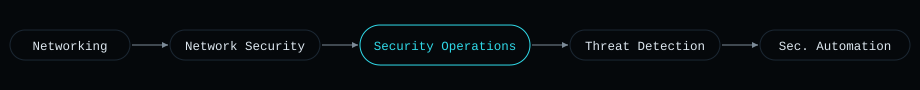
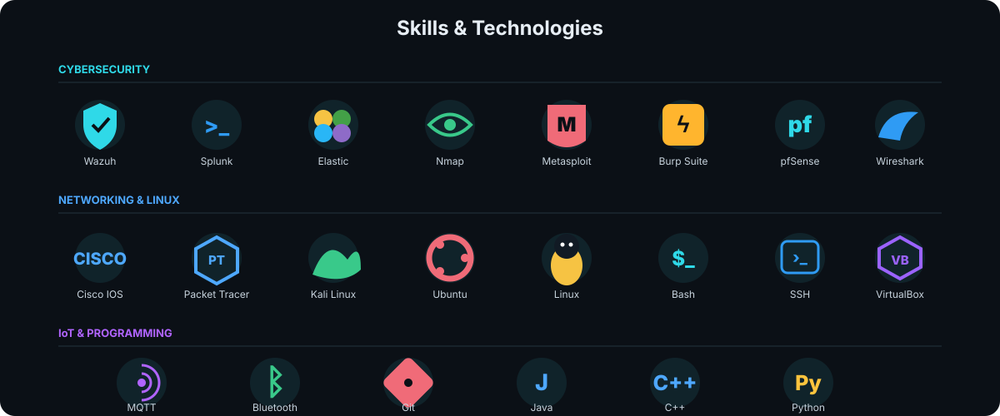
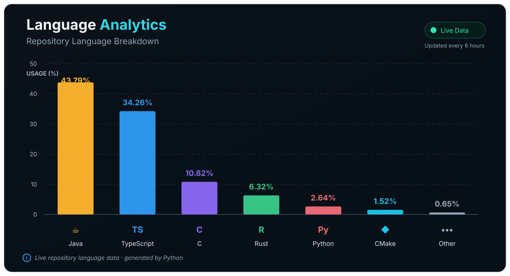
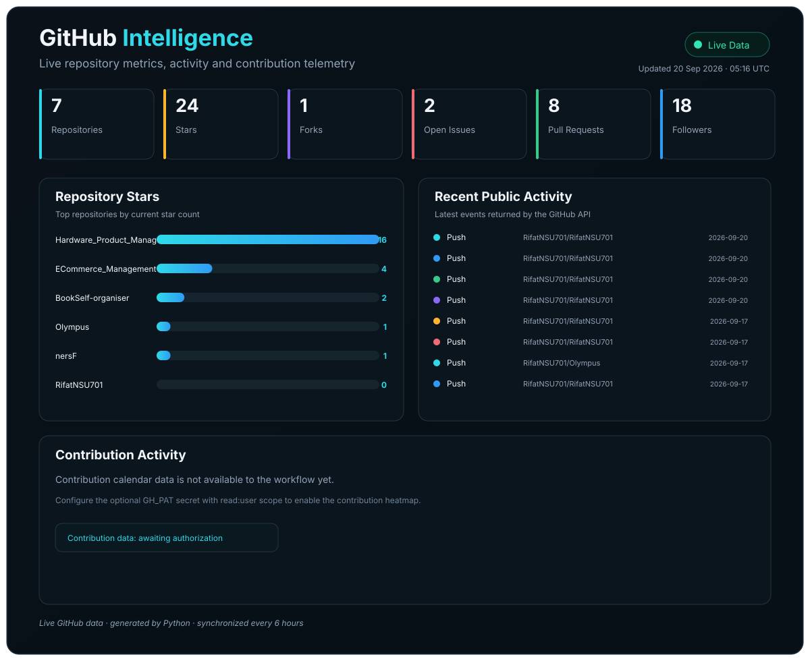

**[→ Open the full interactive dashboard](https://RifatNSU701.github.io/RifatNSU701/)**

<h2 align="center">About Me</h2>

Computer Science & Engineering student focused on **cybersecurity, networking, Linux systems, and IoT security** — building toward security operations, network defense, threat detection, and security automation.

<h2 align="center">Current Mission</h2>

<h2 align="center">Education</h2>

**North South University** — B.Sc. in Computer Science & Engineering (CSE)  
`January 2023 — December 2026`

<h2 align="center">Experience</h2>

**OrionTech** — Founder & CEO  
`August 2026 — Present`

<h2 align="center">Skills &amp; Technologies</h2>

 

<b>CYBERSECURITY SKILLS</b> 
<a href="https://www.nist.gov/cyberframework">Security Monitoring</a> ·
<a href="https://attack.mitre.org/">Threat Hunting</a> ·
<a href="https://attack.mitre.org/">MITRE ATT&amp;CK</a> ·
<a href="https://www.nist.gov/cyberframework">Incident Response</a> ·
<a href="https://www.nist.gov/cyberframework">Vulnerability Assessment</a> ·
<a href="https://owasp.org/">Penetration Testing</a> ·
<a href="https://owasp.org/www-project-top-ten/">Web Security</a> ·
<a href="https://www.nist.gov/cyberframework">Security Auditing</a> ·
<a href="https://www.nist.gov/cyberframework">Risk Assessment</a> ·
<a href="https://attack.mitre.org/">IOC Analysis</a> ·
<a href="https://attack.mitre.org/">TTP Analysis</a> ·
<a href="https://www.nist.gov/cyberframework">Security Architecture</a> ·
<a href="https://www.nist.gov/cyberframework">Identity &amp; Access Management</a> ·
<a href="https://www.cisa.gov/topics/cyber-threats-and-advisories">Digital Forensics</a> ·
<a href="https://www.cisa.gov/topics/cyber-threats-and-advisories">Endpoint Security</a>

  

<b>NETWORKING SKILLS</b> 
<a href="https://www.cisco.com/c/en/us/support/docs/ip/routing-information-protocol-rip/13769-5.html">Routing</a> ·
<a href="https://www.cisco.com/c/en/us/support/docs/lan-switching/spanning-tree-protocol/5234-5.html">Switching</a> ·
<a href="https://www.cisco.com/c/en/us/support/docs/lan-switching/vlan/10023-3.html">VLAN</a> ·
<a href="https://www.cisco.com/c/en/us/support/docs/lan-switching/spanning-tree-protocol/5234-5.html">STP</a> ·
<a href="https://www.cisco.com/c/en/us/support/docs/ip/open-shortest-path-first-ospf/7039-1.html">OSPF</a> ·
<a href="https://www.cisco.com/c/en/us/support/docs/ip/border-gateway-protocol-bgp/13751-1.html">BGP</a> ·
<a href="https://www.cisco.com/c/en/us/support/docs/ip/network-address-translation-nat/13772-12.html">NAT</a> ·
<a href="https://www.cisco.com/c/en/us/support/docs/security/ios-firewall/23602-confaccesslists.html">ACL</a> ·
<a href="https://www.cloudflare.com/learning/network-layer/what-is-quality-of-service-qos/">QoS</a> ·
<a href="https://www.cisco.com/c/en/us/support/docs/security-vpn/ipsec-negotiation-ike-protocols/14106-ipsec.html">IPsec / VPN</a> ·
<a href="https://www.cloudflare.com/learning/network-layer/what-is-dns/">DNS</a> ·
<a href="https://www.cloudflare.com/learning/ddos/glossary/what-is-dhcp/">DHCP</a> ·
<a href="https://www.cloudflare.com/learning/network-layer/what-is-ipv6/">IPv4 / IPv6</a> ·
<a href="https://www.wireshark.org/docs/">Traffic Analysis</a> ·
<a href="https://www.cisco.com/c/en/us/solutions/enterprise-networks/what-is-network-monitoring.html">Network Monitoring</a>

 

<h2 align="center">Language Analytics</h2>

<!-- LANGUAGE_ANALYTICS_START -->

<!-- LANGUAGE_ANALYTICS_END -->

<h2 align="center">Certifications</h2>

<!-- CERTIFICATIONS_START -->

<!-- CERTIFICATIONS_END -->

<h2 align="center">GitHub Intelligence</h2>

<!-- GITHUB_INTELLIGENCE_START -->

<!-- GITHUB_INTELLIGENCE_END -->

<h2 align="center">Interactive Dashboard</h2>

**[Open the full cybersecurity dashboard →](https://RifatNSU701.github.io/RifatNSU701/)**

The dashboard contains the richer animated interface, technology matrix, Chart.js visualizations, GitHub intelligence, activity feed, and automatically synchronized repository analytics.

<h2 align="center">Connect</h2>

[GitHub](https://github.com/RifatNSU701) · [LinkedIn](https://linkedin.com/in/rifatcrs) · [Portfolio](https://rifatkhan.tech) · [X](https://x.com/MRKhan24154476)
